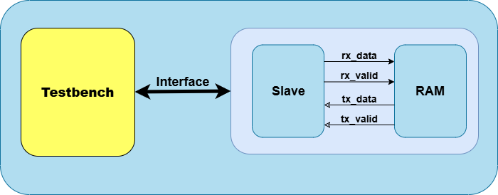

# SPI Slave with Single-Port RAM Verification

A SystemVerilog-based verification environment for an SPI slave controller with integrated single-port RAM functionality.

## Overview

This project implements a comprehensive verification testbench for an SPI slave device that interfaces with an internal asynchronous RAM. The verification environment uses UVM methodology with constrained-random testing and coverage-driven verification to ensure protocol compliance and functional correctness.

### Key Features
- **SPI Protocol**: Mode 0 compliance verification
- **Memory Interface**: Single-port RAM with read/write operations
- **Data Integrity**: End-to-end data verification
- **Reset Handling**: Asynchronous reset behavior validation
- **Coverage Analysis**: Functional and code coverage reporting

## Architecture



### DUT Interface

| Signal     | Direction | Width | Description                      |
|------------|-----------|-------|----------------------------------|
| `MOSI`     | Input     | 1     | Master Out Slave In              |
| `tx_valid` | Input     | 1     | Transmit data valid signal       |
| `tx_data`  | Input     | 8     | 8-bit input data                 |
| `rst_n`    | Input     | 1     | Active-low asynchronous reset    |
| `MISO`     | Output    | 1     | Master In Slave Out              |
| `rx_valid` | Output    | 1     | Receive data valid signal        |
| `rx_data`  | Output    | 10    | 10-bit output data               |

## Test Plan

### Test Categories

| Test Type | Description | Priority |
|-----------|-------------|----------|
| **Basic Tests** | Protocol compliance, basic read/write | High |
| **Corner Cases** | Edge addresses, boundary conditions | High |
| **Stress Tests** | Back-to-back operations, random patterns | Medium |
| **Error Tests** | Protocol violations, reset scenarios | Medium |

### Key Test Cases
- `spi_basic_test`: Basic read/write operations
- `spi_corner_test`: Address boundary testing
- `spi_random_test`: Constrained random verification
- `spi_reset_test`: Reset behavior validation
- `spi_stress_test`: High-frequency operation testing

## Verification Goals

### Functional Coverage
- **Command Coverage**: READ/WRITE operations (100%)
- **Address Coverage**: Full RAM address space (100%)
- **Data Patterns**: Corner cases and random data (95%)
- **State Transitions**: All valid DUT states (100%)

### Assertions
- SPI protocol compliance (timing, signal behavior)
- Data integrity checks
- Control signal validation
- Reset behavior verification

## Running Tests

### Individual Tests
```bash
make test TEST=<test_name> [SEED=<seed>] [VERBOSITY=<level>]
```

### Coverage Analysis
```bash
make coverage
```

### Generate Reports
```bash
make reports
```

## Results

Test results and coverage reports are generated in the `Reports/` directory:
- `test_results.html`: Test execution summary
- `coverage_report.html`: Functional and code coverage
- `assertion_report.html`: SVA results

## Contributing

1. Follow the existing code style and naming conventions
2. Add appropriate documentation for new features
3. Ensure all tests pass before submitting
4. Update coverage goals if adding new functionality

## License

This project is licensed under the MIT License - see the LICENSE file for details.

## Contact

For questions or issues, please contact the verification team or create an issue in the repository.


# SV-based-verification-SPI-slave-with-single-port-RAM
## 📝 Overview & DUT
### Architecture

### Plan Overview
This section provides a high-level summary of the verification project. The primary goal is to ensure the functional correctness and protocol compliance of the SPI Slave DUT, which uses an internal asynchronous RAM. This interactive plan outlines the strategy, environment, and specific tests required to achieve comprehensive verification.
### Key Features to Verify
1.  SPI slave protocol compliance (Mode 0).
2.  Correct handling of read/write commands.
3.  Data integrity for all RAM operations.
4.  Correct behavior of control signals.
5.  Proper handling of asynchronous reset.
### DUT Interface Signals
| Signal     | Direction | Width | Description                      |
|------------|-----------|-------|----------------------------------|
| MOSI       | Input     | 1     | Master Out Slave In              |
| tx_valid   | Input     | 1     | Valid signal for input data      |
| tx_data    | Input     | 8     | 8-bit SPI input data             |
| rst_n      | Input     | 1     | Active-low asynchronous reset    |
| MISO       | Output    | 1     | Master In Slave Out              |
| rx_valid   | Output    | 1     | Output valid signal              |
| rx_data    | Output    | 10    | 10-bit SPI output data           |
## 🏗️ Environment
### Verification Environment (VE)
This section details the UVM-based verification environment built to test the DUT. The diagram below illustrates the key components and their connections. This architecture enables a constrained-random, coverage-driven approach, ensuring robust and thorough testing. Click on a component's description to highlight it in the diagram.


## 🧪 Test Plan
This section lists the specific test cases designed to verify the DUT. The chart below provides a visual breakdown of tests by priority, allowing for a quick assessment of the verification effort. You can click on a priority in the chart or use the filters to focus on specific test categories in the table.
## 🎯 Verification Goals
This section defines the success criteria for the project. Verification is considered complete when all functional coverage points are met and all assertions pass consistently across the regression tests. These goals ensure that all specified features have been thoroughly exercised.
### Functional Coverage Plan
#### Transaction Coverage
1. Cover `READ` and `WRITE` commands.
2. Cover entire RAM address range (corners & regions).
3. Cover key data patterns (all 0s, all 1s, walking, etc).
4. Cross command types with address ranges.
#### DUT State Coverage
1. Cover transitions between idle, read, and write states.
2. Cover back-to-back read and write operations.
### SystemVerilog Assertions (SVA)
#### Protocol Assertions
1. `MISO` must be high-Z when `cs_n` is high.
2. `MOSI` data must be stable on `sclk` active edge.
3. `cs_n` must remain low for the entire transaction.
#### Behavioral Assertions
1. `rx_valid` must assert after a read command.
2. `rx_valid` must be a single-cycle pulse.
3. `MISO` must not be driven during a write operation.
