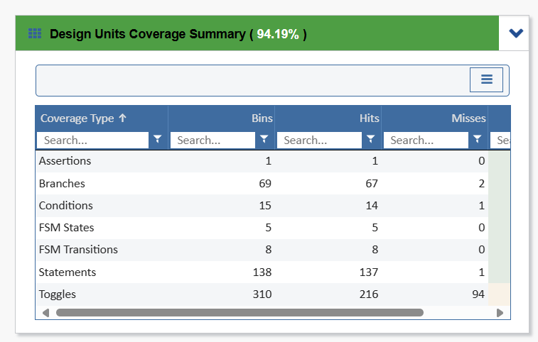
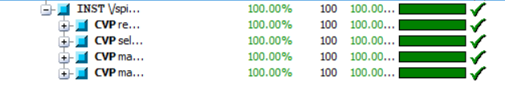

# SPI Slave with Single-Port RAM Verification

A SystemVerilog-based verification environment for an SPI slave controller with integrated single-port RAM functionality.

## Overview

This project implements a comprehensive verification testbench for an SPI slave device that interfaces with an internal asynchronous RAM. The verification environment uses UVM methodology with constrained-random testing and coverage-driven verification to ensure protocol compliance and functional correctness.

### Key Features
- **SPI Protocol**: Mode 0 compliance verification
- **Memory Interface**: Single-port RAM with read/write operations
- **Data Integrity**: End-to-end data verification
- **Reset Handling**: Asynchronous reset behavior validation
- **Coverage Analysis**: Functional and code coverage reporting

## Architecture

### DUT Interface

| Signal     | Direction | Width | Description                      |
|------------|-----------|-------|----------------------------------|
| `MOSI`     | Input     | 1     | Master Out Slave In              |
| `tx_valid` | Input     | 1     | Transmit data valid signal       |
| `tx_data`  | Input     | 8     | 8-bit input data                 |
| `rst_n`    | Input     | 1     | Active-low asynchronous reset    |
| `MISO`     | Output    | 1     | Master In Slave Out              |
| `rx_valid` | Output    | 1     | Receive data valid signal        |
| `rx_data`  | Output    | 10    | 10-bit output data               |

## Test Plan

### Test Categories

| Test Type | Description | Priority |
|-----------|-------------|----------|
| **Basic Tests** | Protocol compliance, basic read/write | High |
| **Corner Cases** | Edge addresses, boundary conditions | High |
| **Stress Tests** | Back-to-back operations, random patterns | Medium |
| **Error Tests** | Protocol violations, reset scenarios | Medium |

### Key Test Cases
- `spi_basic_test`: Basic read/write operations
- `spi_corner_test`: Address boundary testing
- `spi_random_test`: Constrained random verification
- `spi_reset_test`: Reset behavior validation
- `spi_stress_test`: High-frequency operation testing

## Verification Goals

### Functional Coverage
- **Command Coverage**: READ/WRITE operations (100%)
- **Address Coverage**: Full RAM address space (100%)
- **State Transitions**: All valid DUT states (100%)

### Assertions
- SPI protocol compliance (timing, signal behavior)
- Data integrity checks
- Control signal validation
- Reset behavior verification

## Running Tests
### Coverage Analysis
#### Code Coverage Summary

#### Functional Coverage Summary

## Results

Test results and coverage reports are generated in the `Reports/` directory:
- `Fcover_report.txt`: Test execution summary
- `Scover_report.txt`: Functional and code coverage
- `assertion_report.txt`: SVA results
